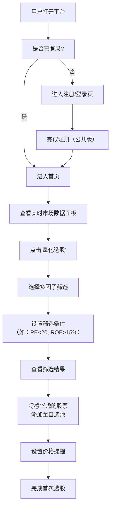
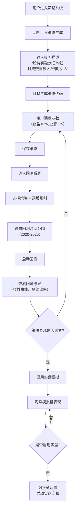
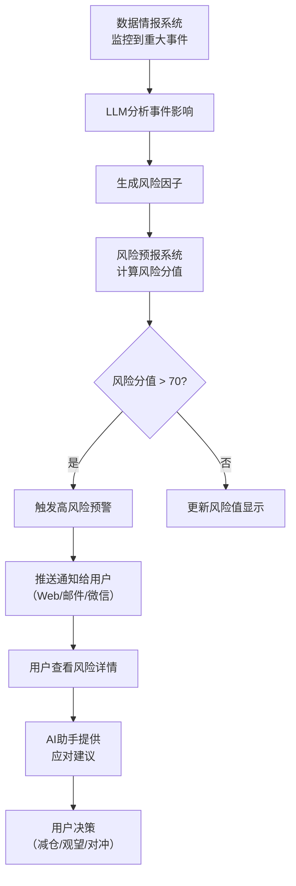
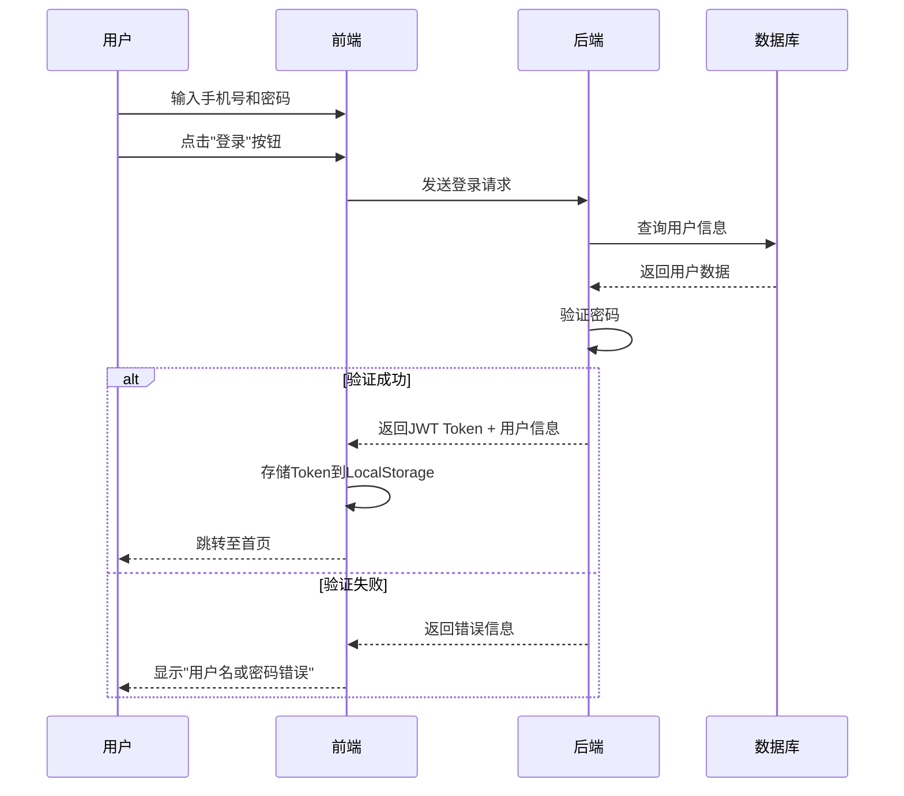
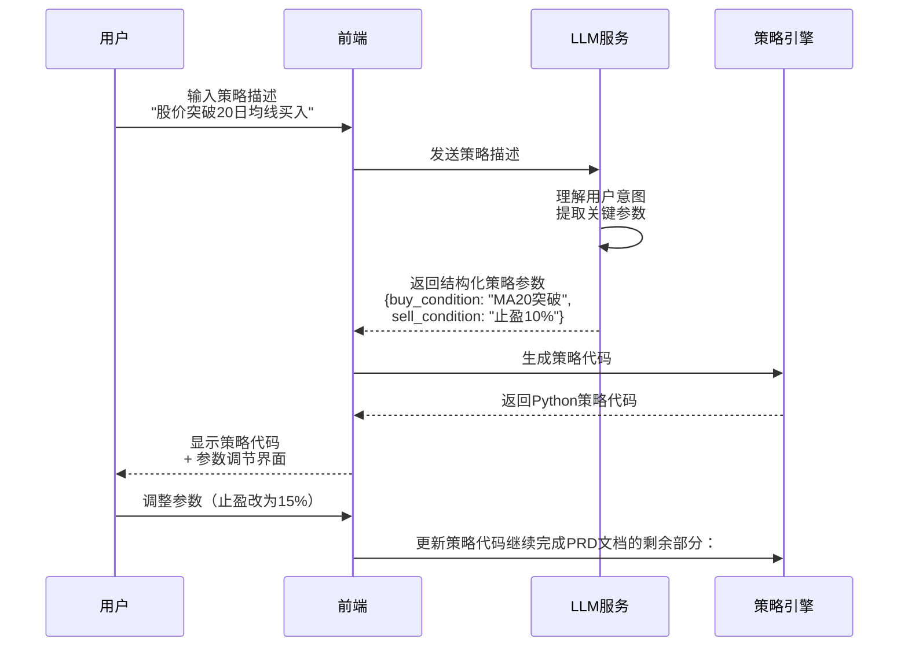
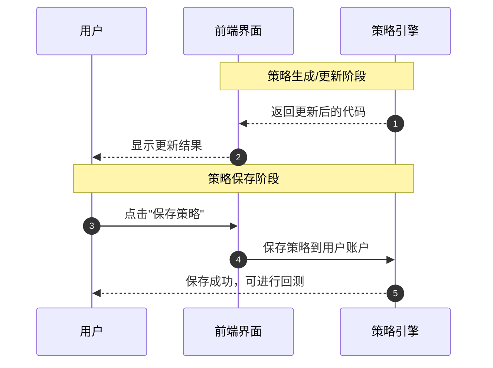
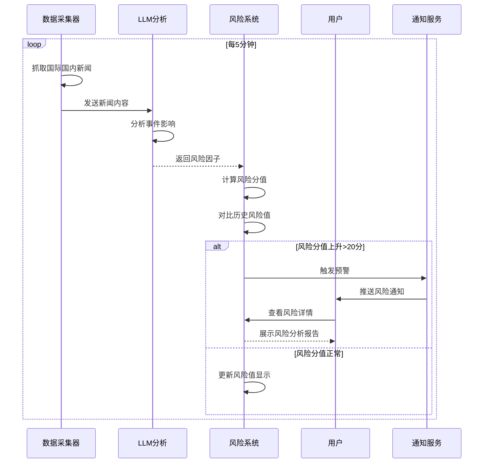
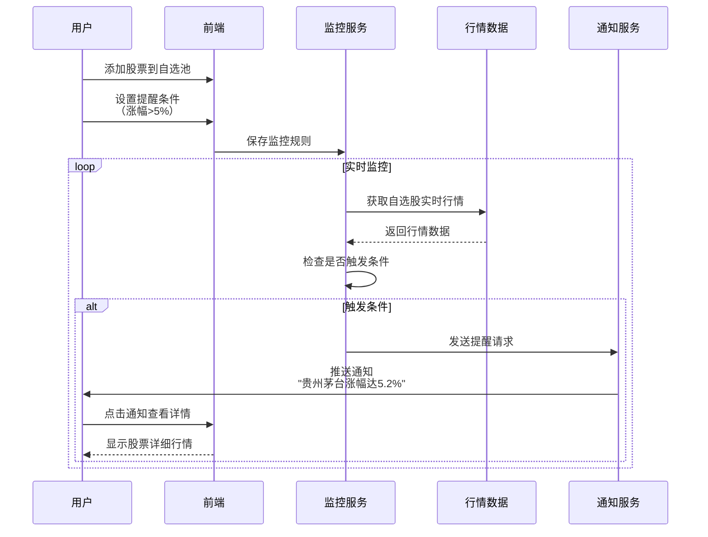
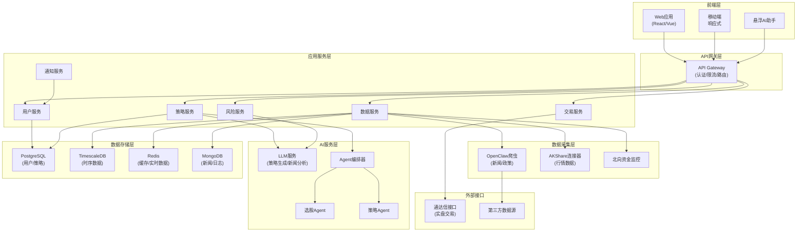
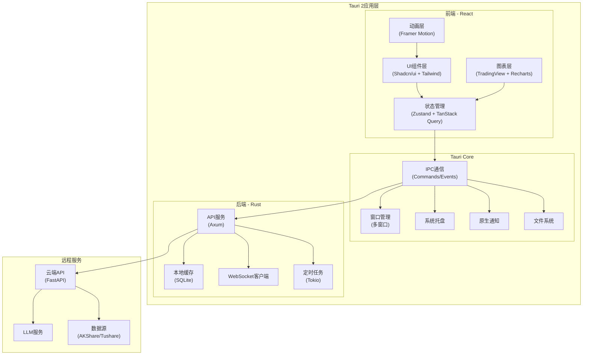

# 产品需求文档 (PRD): 智能量化投资平台 (SmartQuant)

## 0. 核心假设 (Core Assumptions)

- **核心目标用户假设:** 本产品主要面向具备一定投资经验、希望通过量化手段提升投资效率的个人投资者和小型投资团队（资金规模10万-500万）
- **核心痛点假设:** 假设当前市场上的量化平台存在以下问题：1) 专业门槛高，普通投资者难以上手；2) 数据源分散，缺乏整合的信息情报系统；3) 策略开发效率低，缺少AI辅助工具；4) 实盘交易对接复杂
- **商业模式假设:** 采用分级订阅制（Freemium + 专业版订阅），通过公共版引流，专业版付费解锁核心功能，个人顶配版提供完整能力
- **技术架构假设:** 基于Agent架构 + Web前端 + OpenClaw数据抓取，使用LLM进行智能分析和策略生成

## 1. 产品背景 (Product Background)

### 市场趋势
- **量化投资普及化:** 2024-2026年，中国个人投资者对量化工具的需求年增长率超过35%，量化私募管理规模突破1.5万亿
- **AI赋能金融:** GPT等大语言模型在金融分析领域的应用快速增长，智能投顾和AI策略生成成为新趋势
- **数据驱动决策:** 投资者越来越依赖多维度数据（国际局势、政策导向、市场情绪）进行决策，单一技术分析已不足够

### 用户痛点
1. **信息过载但缺乏整合:** 投资者需要在多个平台间切换查看新闻、数据、行情，效率低下
2. **策略开发门槛高:** 传统量化平台需要编程能力，普通投资者难以快速验证投资想法
3. **风险感知滞后:** 缺少实时的风险预警系统，无法及时应对市场突发事件
4. **媒体信息质量参差:** 难以辨别新闻来源的可靠性，容易被"黑嘴"误导
5. **实盘交易脱节:** 回测与实盘交易分离，策略执行效率低

### 机会与价值
- **差异化定位:** 通过AI Agent + 情报系统 + 实时交易的三位一体架构，打造"智能投资大脑"
- **降低使用门槛:** LLM辅助策略生成，让非技术用户也能快速构建量化策略
- **信息质量保障:** 内置媒体质量评估体系，过滤低质量信息源
- **全流程闭环:** 从选股、策略制定、风险监控到实盘交易的完整闭环

## 2. 产品调研 (Product Research)

### 目标用户画像

**核心用户群体1: 进阶个人投资者**

- **年龄:** 28-45岁
- **职业:** 互联网从业者、金融从业者、企业中高层
- **投资经验:** 3-8年，有一定技术分析基础
- **资金规模:** 20万-200万
- **核心需求:** 提升投资效率，降低情绪化决策，寻找系统化投资方法
- **痛点:** 时间有限，无法全天盯盘；缺少编程能力，难以实现策略自动化

**核心用户群体2: 小型投资团队/工作室**
- **规模:** 2-5人
- **资金规模:** 100万-500万
- **核心需求:** 需要协作工具、策略回测、风险管理系统
- **痛点:** 现有平台功能分散，需要多个工具配合；数据成本高

### 竞品分析

| 竞品名称         | 核心功能                     | 优势                        | 劣势                                   |
| :--------------- | :--------------------------- | :-------------------------- | :------------------------------------- |
| 聚宽 (JoinQuant) | 策略回测、社区分享、云端运行 | 数据全面、社区活跃、API稳定 | 需要编程能力、实盘对接有限、缺少AI辅助 |
| 米筐 (RiceQuant) | 多资产回测、因子分析         | 专业度高、支持多市场        | 学习曲线陡峭、个人版功能受限           |
| 优矿 (Uqer)      | 因子挖掘、策略研究           | 因子库丰富、研究工具专业    | 界面复杂、缺少实时交易、无AI功能       |
| 东方财富Choice   | 实时行情、资讯、数据终端     | 数据权威、行情实时          | 无量化策略功能、价格昂贵（专业版）     |
| 通达信           | 实盘交易、技术分析           | 交易稳定、用户基数大        | 无量化回测、无AI分析、界面老旧         |

**竞争优势总结:**
- ✅ **AI原生:** 全流程LLM赋能，降低使用门槛
- ✅ **情报整合:** 独有的数据情报系统，整合国际国内多维度信息
- ✅ **媒体质量评估:** 内置媒体可信度分级，过滤噪音
- ✅ **实时风险预警:** 动态风险评估系统
- ✅ **实盘直连:** 对接通达信，策略直接执行

## 3. 需求概述 (Requirement Overview)

### 产品愿景
打造个人投资者的"AI量化投资大脑"，让每个人都能用上专业级的量化投资工具。

### 核心功能列表 (MVP)
1. **量化选股系统:** 多因子筛选、情绪权重分析
2. **实时市场数据面板:** 大盘指数、自选池监控、涨幅榜
3. **基础策略系统:** LLM辅助策略生成（买卖点、波动率）
4. **风险预警:** 实时风险评分
5. **回测分析:** 策略历史表现验证
6. **悬浮AI助手:** 快速解析新闻和市场现状

## 4. 功能需求 (Functional Requirements)

### 4.1 量化选股系统【核心模块】

**FR-01: 多因子策略引擎**
- 支持自定义因子组合（技术面、基本面、情绪面）
- 内置常用因子库：PE/PB、ROE、成交量、换手率、北向资金流向、社交媒体情绪指数
- 因子权重可调节，支持动态权重优化

**FR-02: 情绪因子优先级分析**
- 基于社交媒体、新闻热度、资金流向计算市场情绪分
- 情绪分与传统因子加权计算最终评分
- 提供情绪波动预警

**FR-03: 单/多因子筛选器**
- 支持单因子快速筛选（如：只看PE<20的股票）
- 支持多因子组合筛选（如：PE<20 AND ROE>15% AND 北向资金净流入）
- 筛选结果实时更新，支持保存为自选池

**FR-04: 动态风险预估**
- 基于历史波动率、Beta系数、行业相关性计算个股风险值
- 实时更新风险评分（0-100分，>70为高风险）
- 提供风险分散建议

**FR-05: 全球金融数据集成 (AKShare)**
- 集成AKShare数据源，覆盖A股全市场数据
- 支持数据自动更新和缓存机制
- 提供数据质量监控

### 4.2 数据情报系统【数据收集+规整】

**FR-06: 国际情报监控**
- 自动抓取国际重大事件（战争、贸易关税、美联储加减息）
- LLM分析事件对A股的潜在影响，生成风险因子
- 重大风险自动推送至风险预报系统

**FR-07: 国内政策解析**
- 监控国务院、发改委、证监会等官方政策发布
- LLM提取政策关键要点，识别受益行业
- 自动匹配行业龙头股票，推送至选股池

**FR-08: 市场行业前沿追踪**
- 监控GitHub热门项目（科技行业）
- 监控X (Twitter) 关键账号（国际市场动态）
- 监控行业会议、展会信息

**FR-09: 媒体质量评估系统**
- 内置媒体可信度分级（良好/正常/黑嘴）
- 新闻来源自动标注质量等级
- 用户可自定义屏蔽低质量媒体

### 4.3 实时市场数据面板【核心模块】

**FR-10: 大盘指数监控**
- 实时显示上证指数、深证成指、创业板指、科创50
- 显示涨跌幅、成交量、换手率
- 支持分时图、K线图切换

**FR-11: 股票查询功能**
- 支持股票代码、名称、拼音首字母快速搜索
- 显示个股实时行情、分时图、基本面数据
- 支持添加至自选池

**FR-12: 自选池监控【监控+提醒】**
- **持有股监控:** 实时显示持仓股票盈亏、涨跌幅
- **观察股监控:** 监控关注股票，触发条件时提醒（如：涨幅>5%、跌破支撑位）
- 支持自定义提醒条件（价格、涨跌幅、成交量）
- 多端推送（Web通知、邮件、微信）

**FR-13: 最新新闻实时推送**
- 抓取权威媒体（新华社、第一财经、科创板日报等）
- 自动过滤低质量媒体（财联社、券商中国等黑嘴）
- 新闻与相关股票自动关联

**FR-14: 实时风险值评估**
- 综合市场波动、国际局势、政策变化计算风险值
- 风险值分级：低风险(0-30)、中风险(30-70)、高风险(70-100)
- 风险值变化趋势图

**FR-15: 个股涨幅榜**
- 小窗滑动浏览，显示当日涨幅Top 50
- 支持按板块、市值筛选
- 点击个股快速查看详情

**FR-16: 行业涨幅榜**
- 显示当日行业涨幅Top 10
- 显示行业内领涨股票
- 行业资金流向数据

**FR-17: 北向资金监控**
- 实时抓取北向资金流入/流出数据
- 显示北向资金持仓Top 10股票
- 北向资金流向趋势图

### 4.4 量化策略系统【核心模块】

**FR-18: LLM快速策略生成工具**
- 用户用自然语言描述策略想法（如："当股价突破20日均线且成交量放大时买入"）
- LLM自动生成策略代码（Python/回测框架）
- 策略参数可视化调节：
  - 买点条件（技术指标、价格、成交量）
  - 卖点条件（止盈、止损、时间止损）
  - 波动率控制（均线差、平均率）
  - 最长持有时间

**FR-19: Agent绑定工具**
- 支持将选股Agent与策略Agent组合
- 单策略模式：一个选股规则 + 一个交易策略
- 组合型策略：多个策略并行运行，资金分配可调

**FR-20: 策略参数优化**

- 自动寻找最优参数组合（网格搜索/遗传算法）
- 显示参数敏感度分析
- 防止过拟合警告

### 4.5 风险预报系统【辅助模块】

**FR-21: 数据采集反馈**
- 监控数据情报系统采集的国际国内事件
- 识别潜在风险事件（如：地缘冲突升级、政策收紧）
- 生成风险预警报告

**FR-22: 市场波动反馈**
- 监控市场异常波动（如：指数单日跌幅>3%）
- 监控个股异常（如：闪崩、放量涨停）
- 触发风险预警

**FR-23: 风险分值计算**
- 综合多维度数据计算风险分值（0-100）
- 风险分值实时更新
- 历史风险分值回溯

### 4.6 回测分析【辅助模块】

**FR-24: 策略回测引擎**
- 支持策略Agent + 选股Agent组合回测
- 回测时间范围可选（最长支持10年历史数据）
- 回测频率：日线级别（MVP），后续支持分钟级

**FR-25: 回测结果可视化**
- 显示策略收益曲线、最大回撤、夏普比率、胜率
- 显示每笔交易明细
- 支持多策略对比

**FR-26: Agent策略可视化对比**
- 同时对比多个Agent策略的表现
- 生成策略优劣分析报告
- 推荐最优策略组合

### 4.7 实时交易系统

**FR-27: 通达信接口对接**
- 对接通达信交易接口，支持实盘下单
- 支持市价单、限价单
- 实时同步持仓、资金、成交数据

**FR-28: 模拟盘功能**
- 提供虚拟资金进行模拟交易
- 模拟盘回测：基于历史数据按天回测
- 实时模拟：基于当前行情实时模拟交易

**FR-29: Tick数据支持**
- 按需获取Tick级别数据（分钟/秒级）
- 用于高频策略回测和实时模拟

### 4.8 悬浮AI助手

**FR-30: 智能解析功能**
- 解析最新新闻，提取关键信息和影响
- 分析当前市场现状（使用数据分析skill）
- 辅助投资策略选择，提供建议

**FR-31: 多模态交互**
- 支持文字对话
- 支持语音输入（后续版本）
- 支持图表数据查询

### 4.9 用户系统与商业化

**FR-32: 用户注册与登录**
- 支持手机号/邮箱注册
- 支持第三方登录（微信、支付宝）
- 用户信息管理

**FR-33: 分级订阅系统**
- **公共版（免费）:** 基础选股、有限回测次数、延迟行情
- **专业版（付费）:** 完整选股功能、无限回测、实时行情、策略生成、风险预警
- **个人顶配版（高级付费）:** 全部功能 + 实盘交易 + 优先客服 + 定制化策略

**FR-34: 支付系统**
- 支持月付/年付订阅
- 支持微信支付、支付宝
- 自动续费管理

### 4.10 引流与生态

**FR-35: Coze工具引流**
- 制作专业化Coze工具，暴露部分能力给外部Agent
- 提供API接口供第三方调用（有限额度）

**FR-36: 自媒体矩阵**
- 在微信公众号、知乎、B站、小红书等平台发布内容
- 提供免费策略模板和投资教程
- 引导用户注册使用

## 5. 非功能需求 (Non-Functional Requirements)

### 性能要求
- **页面加载时间:** 首屏加载<2秒，数据刷新<500ms
- **实时数据延迟:** 行情数据延迟<3秒（专业版），<15秒（公共版）
- **回测速度:** 单策略10年日线回测<30秒
- **并发支持:** 支持5000+用户同时在线

### 安全性要求
- **数据加密:** 用户密码、交易密钥采用AES-256加密存储
- **通信安全:** 全站HTTPS，API接口使用JWT/Ouath认证
- **交易安全:** 实盘交易需二次验证（短信验证码/动态口令）
- **数据隔离:** 用户数据严格隔离，不可互相访问

### 可用性要求
- **系统可用性:** 99.5%以上（允许每月停机时间<3.6小时）
- **数据备份:** 每日全量备份，实时增量备份
- **容灾恢复:** RTO<1小时，RPO<15分钟

### 兼容性要求
- **浏览器兼容:** Chrome 90+, Firefox 88+, Safari 14+, Edge 90+
- **移动端:** 响应式设计，支持iOS 13+, Android 8+
- **分辨率:** 支持1920x1080及以上分辨率，最低支持1366x768

### 可扩展性要求
- **数据源扩展:** 架构支持快速接入新数据源（如：港股、美股）
- **策略框架:** 支持用户自定义策略插件
- **API开放:** 提供RESTful API供高级用户调用

### 合规性要求
- **金融牌照:** 不提供投资建议，仅提供工具和数据分析
- **免责声明:** 明确告知用户投资风险，平台不承担投资损失
- **数据合规:** 数据来源合法，不侵犯第三方版权

## 6. 用户故事 (User Stories)

### 角色一: 新手投资者（公共版用户）
- "作为一个**新手投资者**，我想要**快速了解当前市场热点行业**，以便于**找到潜在投资机会**。"
- "作为一个**新手投资者**，我想要**使用AI助手解读复杂的财经新闻**，以便于**理解新闻对股价的影响**。"
- "作为一个**新手投资者**，我想要**看到媒体的可信度评级**，以便于**避免被黑嘴误导**。"

### 角色二: 进阶投资者（专业版用户）
- "作为一个**进阶投资者**，我想要**用自然语言快速生成交易策略**，以便于**验证我的投资想法**。"
- "作为一个**进阶投资者**，我想要**实时监控自选股的风险值**，以便于**及时调整仓位**。"
- "作为一个**进阶投资者**，我想要**回测我的策略在过去5年的表现**，以便于**评估策略的有效性**。"
- "作为一个**进阶投资者**，我想要**接收北向资金异动提醒**，以便于**跟随聪明钱**。"

### 角色三: 量化交易者（个人顶配版用户）
- "作为一个**量化交易者**，我想要**将策略直接对接实盘交易**，以便于**实现全自动交易**。"
- "作为一个**量化交易者**，我想要**组合多个策略Agent并行运行**，以便于**分散风险并提高收益**。"
- "作为一个**量化交易者**，我想要**获取Tick级别的历史数据**，以便于**开发高频策略**。"
- "作为一个**量化交易者**，我想要**实时监控国际重大事件**，以便于**提前规避系统性风险**。"

### 角色四: 投资团队管理者
- "作为一个**投资团队管理者**，我想要**查看团队成员的策略表现对比**，以便于**评估团队绩效**。"
- "作为一个**投资团队管理者**，我想要**设置风险阈值并自动预警**，以便于**控制团队整体风险敞口**。"

## 7. 用户场景 (User Scenarios)

### 场景1: 新用户完成首次选股



### 场景2: 专业用户创建并回测策略



### 场景3: 风险预警触发流程



## 8. 交互设计 (Interaction Design) - 关键流程

### 流程1: 用户登录流程



### 流程2: LLM策略生成流程



---



### 流程3: 实时风险监控与预警流程



### 流程4: 自选股监控与提醒流程



## 9. 成功指标 (Success Metrics)

### 北极星指标
**日活跃策略执行数 (Daily Active Strategy Executions)**
- 定义：每日用户主动运行的策略总次数（包括回测、模拟盘、实盘）
- 目标：MVP上线3个月内达到500次/日，6个月内达到2000次/日
- 意义：直接反映用户对核心功能的使用深度和平台价值

### 一级指标

**用户增长指标**
- **注册用户数:** 6个月内达到10,000人
- **付费转化率:** 公共版→专业版转化率达到8%
- **用户留存率:** 
  - 次日留存率 > 40%
  - 7日留存率 > 25%
  - 30日留存率 > 15%

**功能使用指标**
- **量化选股使用率:** 注册用户中至少使用过1次选股功能的比例 > 70%
- **策略创建数:** 平均每个活跃用户创建策略数 > 3个
- **回测执行率:** 创建策略后进行回测的比例 > 60%
- **实盘对接率:** 专业版用户中对接实盘交易的比例 > 30%

**商业化指标**
- **月度经常性收入 (MRR):** 6个月内达到50万元
- **客单价 (ARPU):** 专业版用户月均消费 > 200元
- **付费用户生命周期价值 (LTV):** > 2000元
- **获客成本 (CAC):** < 500元

### 二级指标

**用户参与度**
- **日均使用时长:** 活跃用户日均使用时长 > 15分钟
- **功能覆盖度:** 用户平均使用功能模块数 > 4个
- **AI助手交互次数:** 日均AI助手对话次数 > 1000次

**数据质量指标**
- **行情数据延迟:** 专业版 < 3秒，公共版 < 15秒
- **新闻抓取及时性:** 重大新闻发布后5分钟内完成抓取
- **媒体质量准确率:** 媒体分级准确率 > 90%（基于用户反馈）

**策略表现指标**
- **回测准确率:** 回测收益与实盘收益误差 < 5%
- **策略胜率:** 平台推荐策略历史胜率 > 55%
- **用户策略分享率:** 用户主动分享策略的比例 > 10%

**风险控制指标**
- **风险预警准确率:** 预警后24小时内市场确实出现波动的比例 > 70%
- **风险预警及时性:** 重大风险事件发生后15分钟内完成预警
- **用户风险感知度:** 用户认为风险系统有帮助的比例 > 80%

**技术性能指标**
- **系统可用性:** > 99.5%
- **页面加载速度:** P95 < 2秒
- **API响应时间:** P95 < 500ms
- **错误率:** < 0.1%

**用户满意度**
- **NPS (净推荐值):** > 40
- **功能满意度评分:** > 4.2/5.0
- **客服响应时间:** < 2小时
- **问题解决率:** > 90%

---

## 10. 技术架构概述 (Technical Architecture Overview)

### 系统架构图



### 核心技术栈建议

**前端技术栈**
- 框架：React 18 + TypeScript
- 状态管理：Zustand / Redux Toolkit
- 图表库：ECharts / TradingView Lightweight Charts
- UI组件：Ant Design / Tailwind CSS
- 实时通信：WebSocket

**后端技术栈**

- 语言：Python 3.11+ (主服务) / Go (高性能服务)
- 框架：FastAPI (Python) / Gin (Go)
- 任务队列：Celery + Redis
- 消息队列：RabbitMQ / Kafka
- 缓存：Redis Cluster

**AI/LLM技术栈**
- LLM：Claude 3.5 / GPT-4 / 国产大模型（通义千问/文心一言）
- Agent框架：LangChain / AutoGen
- 向量数据库：Pinecone / Milvus（用于策略检索）

**数据采集技术栈**
- 爬虫框架：Scrapy / OpenClaw
- 数据源：AKShare、Tushare、东方财富Choice API
- 反爬虫：代理池、User-Agent轮换、验证码识别

**数据存储技术栈**
- 关系型数据库：PostgreSQL 15+
- 时序数据库：TimescaleDB（存储行情数据）
- 缓存：Redis 7+（实时数据、会话）
- 文档数据库：MongoDB（新闻、日志）
- 对象存储：MinIO / 阿里云OSS（回测结果、报告）

**DevOps技术栈**
- 容器化：Docker + Kubernetes
- CI/CD：GitHub Actions / GitLab CI
- 监控：Prometheus + Grafana
- 日志：ELK Stack (Elasticsearch + Logstash + Kibana)
- 链路追踪：Jaeger

---

## 11. 开发路线图 (Development Roadmap)

### Phase 1: MVP核心功能 (0-3个月)

**Sprint 1-2 (Week 1-4): 基础架构 + 用户系统**
- 搭建前后端基础架构
- 用户注册/登录系统
- 数据库设计与初始化
- AKShare数据源对接

**Sprint 3-4 (Week 5-8): 实时数据面板**
- 大盘指数实时显示
- 股票查询功能
- 自选池基础功能
- 涨幅榜/行业榜

**Sprint 5-6 (Week 9-12): 量化选股系统**
- 多因子筛选引擎
- 单/多因子筛选器UI
- 基础风险评估
- 选股结果保存

**里程碑1:** MVP核心功能上线，开放内测

### Phase 2: AI能力 + 策略系统 (3-6个月)

**Sprint 7-8 (Week 13-16): LLM策略生成**
- LLM服务对接
- 自然语言策略生成
- 策略参数可视化调节
- 策略保存与管理

**Sprint 9-10 (Week 17-20): 回测系统**
- 回测引擎开发
- 回测结果可视化
- 策略对比功能
- 历史数据准备

**Sprint 11-12 (Week 21-24): Agent系统**
- Agent编排器
- 选股Agent + 策略Agent组合
- Agent可视化管理

**里程碑2:** AI策略系统上线，开放公测

### Phase 3: 数据情报 + 风险系统 (6-9个月)

**Sprint 13-14 (Week 25-28): 数据情报系统**
- OpenClaw爬虫部署
- 国际国内新闻抓取
- 媒体质量评估系统
- 政策解析功能

**Sprint 15-16 (Week 29-32): 风险预报系统**
- 风险因子计算引擎
- 实时风险评分
- 风险预警推送
- 风险报告生成

**Sprint 17-18 (Week 33-36): 北向资金监控**
- 北向资金数据抓取
- 实时流向监控
- 异动提醒

**里程碑3:** 完整情报与风险系统上线

### Phase 4: 实盘交易 + 商业化 (9-12个月)

**Sprint 19-20 (Week 37-40): 实盘交易对接**

- 通达信接口对接
- 模拟盘功能
- 实盘下单功能
- 交易安全验证

**Sprint 21-22 (Week 41-44): 商业化功能**
- 分级订阅系统
- 支付系统对接
- 用户权限管理
- 数据使用限额控制

**Sprint 23-24 (Week 45-48): 引流与生态**
- Coze工具开发
- API开放平台
- 自媒体内容制作
- 用户增长活动

**里程碑4:** 完整产品上线，开始商业化运营

---

## 12. 风险与挑战 (Risks & Challenges)

### 技术风险

**R-01: 数据源稳定性风险**
- **描述:** AKShare等免费数据源可能不稳定，或突然停止服务
- **影响:** 高
- **应对策略:** 
  - 准备多个备用数据源（Tushare、东方财富API）
  - 建立数据缓存机制，降低对实时数据源的依赖
  - 考虑购买商业数据源作为备份

**R-02: LLM服务成本与性能**
- **描述:** 大量用户使用LLM功能可能导致成本激增，响应速度变慢
- **影响:** 中
- **应对策略:**
  - 对LLM调用进行缓存，相似问题复用结果
  - 分级限制LLM使用次数（公共版每日10次，专业版无限）
  - 考虑使用开源模型（如Llama 3）降低成本

**R-03: 实盘交易接口稳定性**
- **描述:** 通达信接口可能不稳定，导致交易失败
- **影响:** 高
- **应对策略:**
  - 实现交易重试机制
  - 提供多个券商接口备选
  - 明确告知用户交易风险，建议小额测试

### 合规风险

**R-04: 金融监管合规**
- **描述:** 平台可能被认定为提供投资建议，需要金融牌照
- **影响:** 高
- **应对策略:**
  - 明确定位为"工具平台"，不提供投资建议
  - 在所有页面添加免责声明
  - 咨询法律顾问，确保合规

**R-05: 数据版权问题**
- **描述:** 抓取的新闻、数据可能涉及版权问题
- **影响:** 中
- **应对策略:**
  - 只抓取公开信息，注明来源
  - 与主要媒体洽谈合作或授权
  - 使用RSS订阅等合法方式获取内容

### 市场风险

**R-06: 竞品压力**
- **描述:** 聚宽、米筐等成熟平台可能快速跟进AI功能
- **影响:** 中
- **应对策略:**
  - 快速迭代，保持功能领先
  - 强化差异化优势（情报系统、媒体评估）
  - 建立用户社区，提高迁移成本

**R-07: 用户获取成本高**
- **描述:** 量化投资用户群体小众，获客成本可能超预期
- **影响:** 中
- **应对策略:**
  - 通过内容营销（教程、策略分享）降低获客成本
  - 建立推荐奖励机制
  - 与财经自媒体合作推广

### 运营风险

**R-08: 用户投资亏损导致负面口碑**
- **描述:** 用户使用平台策略亏损后可能产生负面评价
- **影响:** 高
- **应对策略:**
  - 强化风险教育，明确投资风险
  - 提供模拟盘让用户先测试
  - 建立用户反馈机制，及时处理问题

---

## 13. 附录 (Appendix)

### A. 术语表 (Glossary)

| 术语       | 定义                                            |
| :--------- | :---------------------------------------------- |
| 多因子策略 | 综合多个指标（如PE、ROE、成交量）进行选股的策略 |
| 北向资金   | 通过沪港通、深港通流入A股的境外资金             |
| 回测       | 使用历史数据验证策略表现的过程                  |
| 夏普比率   | 衡量策略风险调整后收益的指标，越高越好          |
| 最大回撤   | 策略在历史上从最高点到最低点的最大跌幅          |
| Agent      | 具备自主决策能力的智能体，可执行特定任务        |
| Tick数据   | 逐笔成交数据，精度可达秒级或毫秒级              |
| MVP        | Minimum Viable Product，最小可行产品            |

### B. 参考资料 (References)

- AKShare文档: https://akshare.akfamily.xyz/
- 通达信开放平台: https://www.tdx.com.cn/
- 量化投资行业报告 (2025)
- LangChain官方文档: https://python.langchain.com/
- 中国证监会投资者保护规定

---

## 14. UI/UX设计规范 (UI/UX Design Specifications)

### 14.1 设计理念

**核心设计原则**
- **数据可视化优先**: 复杂金融数据通过图表、热力图、动态指标呈现
- **实时动态反馈**: 所有数据变化都有平滑动画过渡，增强用户感知
- **深色模式为主**: 金融应用长时间使用，深色模式减少眼疲劳
- **信息层级清晰**: 重要信息突出显示，次要信息收起或淡化
- **响应式布局**: 适配桌面、平板、手机多端

### 14.2 现代化UI技术栈（基于Tauri 2）

#### 前端核心技术栈

```
技术架构: Tauri 2 + React 18 + TypeScript
```

**UI框架与组件库**
- **基础框架**: React 18 + TypeScript 5.0+
- **样式方案**: 
  - **Tailwind CSS 3.4+**: 原子化CSS，快速构建响应式布局
  - **CSS Modules**: 组件级样式隔离
  - **Framer Motion**: 高性能动画库，实现流畅的页面过渡和交互动画
- **组件库**: 
  - **Radix UI**: 无样式的可访问组件基础（Headless UI）
  - **Shadcn/ui**: 基于Radix UI的现代化组件库，可定制性强
  - **Lucide React**: 现代化图标库

**数据可视化**
- **TradingView Lightweight Charts**: 专业级K线图、分时图
- **Recharts**: 声明式图表库，用于策略收益曲线、回测结果
- **D3.js**: 自定义复杂可视化（如：资金流向桑基图、因子相关性热力图）
- **React Flow**: 策略流程可视化、Agent关系图

**动画与交互**
- **Framer Motion**: 页面过渡、组件动画、手势交互
- **React Spring**: 物理动画效果（如：数字滚动、弹性动画）
- **GSAP**: 复杂时间轴动画（如：数据加载动画）
- **Lottie**: 矢量动画（加载状态、空状态插画）

**状态管理与数据流**
- **Zustand**: 轻量级状态管理，替代Redux
- **TanStack Query (React Query)**: 服务端状态管理、缓存、实时更新
- **Jotai**: 原子化状态管理，用于复杂表单和局部状态

**实时通信**
- **WebSocket**: 实时行情推送
- **Tauri Events**: 前后端通信（Rust后端 ↔ React前端）
- **Server-Sent Events (SSE)**: 单向实时推送（新闻、风险预警）

#### Tauri 2后端技术栈

**核心语言**: Rust 1.75+

**Tauri 2特性**
- **多窗口管理**: 主窗口 + 悬浮助手窗口 + 行情弹窗
- **系统托盘**: 后台运行，实时监控提醒
- **原生菜单**: 快捷操作菜单
- **文件系统访问**: 本地策略保存、回测结果导出
- **系统通知**: 原生通知推送（价格提醒、风险预警）
- **自动更新**: 应用自动更新机制

**Rust后端服务**
- **Tokio**: 异步运行时
- **Axum**: 高性能Web框架（内部API服务）
- **SQLx**: 数据库访问（SQLite本地缓存）
- **Reqwest**: HTTP客户端（调用远程API）
- **Serde**: 序列化/反序列化

**本地数据存储**
- **SQLite**: 本地缓存（历史行情、策略配置）
- **IndexedDB**: 浏览器端大数据存储
- **Tauri Store**: 应用配置持久化

### 14.3 UI设计系统

#### 色彩系统

**深色主题（默认）**
```css
/* 背景色 */
--bg-primary: #0a0e1a;      /* 主背景 */
--bg-secondary: #131824;    /* 卡片背景 */
--bg-tertiary: #1a2030;     /* 悬浮层背景 */

/* 文字色 */
--text-primary: #e4e7eb;    /* 主文字 */
--text-secondary: #9ca3af;  /* 次要文字 */
--text-tertiary: #6b7280;   /* 辅助文字 */

/* 品牌色 */
--brand-primary: #3b82f6;   /* 主品牌色（蓝） */
--brand-secondary: #8b5cf6; /* 次品牌色（紫） */

/* 功能色 */
--success: #10b981;         /* 上涨/成功 */
--danger: #ef4444;          /* 下跌/危险 */
--warning: #f59e0b;         /* 警告 */
--info: #06b6d4;            /* 信息 */

/* 数据可视化色板 */
--chart-up: #10b981;        /* 涨 */
--chart-down: #ef4444;      /* 跌 */
--chart-neutral: #6b7280;   /* 平 */
```

**浅色主题（可选）**
```css
--bg-primary: #ffffff;
--bg-secondary: #f9fafb;
--text-primary: #111827;
--text-secondary: #4b5563;
```

#### 排版系统

```css
/* 字体家族 */
--font-sans: 'Inter', 'PingFang SC', 'Microsoft YaHei', sans-serif;
--font-mono: 'JetBrains Mono', 'Fira Code', monospace;

/* 字号 */
--text-xs: 0.75rem;    /* 12px - 辅助信息 */
--text-sm: 0.875rem;   /* 14px - 次要文字 */
--text-base: 1rem;     /* 16px - 正文 */
--text-lg: 1.125rem;   /* 18px - 小标题 */
--text-xl: 1.25rem;    /* 20px - 标题 */
--text-2xl: 1.5rem;    /* 24px - 大标题 */
--text-3xl: 2rem;      /* 32px - 数据展示 */

/* 行高 */
--leading-tight: 1.25;
--leading-normal: 1.5;
--leading-relaxed: 1.75;
```

#### 间距系统

```css
/* 基于8px网格 */
--spacing-1: 0.25rem;  /* 4px */
--spacing-2: 0.5rem;   /* 8px */
--spacing-3: 0.75rem;  /* 12px */
--spacing-4: 1rem;     /* 16px */
--spacing-6: 1.5rem;   /* 24px */
--spacing-8: 2rem;     /* 32px */
--spacing-12: 3rem;    /* 48px */
```

#### 圆角系统

```css
--radius-sm: 0.25rem;  /* 4px - 小元素 */
--radius-md: 0.5rem;   /* 8px - 卡片 */
--radius-lg: 0.75rem;  /* 12px - 大卡片 */
--radius-xl: 1rem;     /* 16px - 模态框 */
--radius-full: 9999px; /* 圆形 */
```

#### 阴影系统

```css
--shadow-sm: 0 1px 2px 0 rgba(0, 0, 0, 0.05);
--shadow-md: 0 4px 6px -1px rgba(0, 0, 0, 0.1);
--shadow-lg: 0 10px 15px -3px rgba(0, 0, 0, 0.1);
--shadow-xl: 0 20px 25px -5px rgba(0, 0, 0, 0.1);
--shadow-glow: 0 0 20px rgba(59, 130, 246, 0.3); /* 发光效果 */
```

### 14.4 核心页面布局设计

#### 主界面布局（桌面端）

```
┌─────────────────────────────────────────────────────────┐
│  [Logo] SmartQuant    [搜索框]      [通知] [设置] [头像] │ ← 顶部导航栏
├──────┬──────────────────────────────────────────────────┤
│      │  ┌────────────────────────────────────────────┐  │
│ 侧   │  │  实时市场数据面板                           │  │
│ 边   │  │  ┌──────┬──────┬──────┬──────┐            │  │
│ 导   │  │  │上证  │深证  │创业板│科创50│  风险值:45 │  │
│ 航   │  │  │3245 │11234 │2456  │1023  │  [中风险]  │  │
│      │  │  │+1.2%│+0.8% │-0.3% │+2.1% │            │  │
│ 📊   │  │  └──────┴──────┴──────┴──────┘            │  │
│ 市场 │  ├────────────────────────────────────────────┤  │
│      │  │  自选股监控 [持有] [观察]                   │  │
│ 🎯   │  │  ┌─────────────────────────────────────┐  │  │
│ 选股 │  │  │ 贵州茅台 600519  1850.00 ▲+2.3% 🔔 │  │  │
│      │  │  │ 宁德时代 300750   245.60 ▼-1.2%    │  │  │
│ 📈   │  │  │ 比亚迪   002594   268.90 ▲+0.8%    │  │  │
│ 策略 │  │  └─────────────────────────────────────┘  │  │
│      │  ├────────────────────────────────────────────┤  │
│ 🔄   │  │  涨幅榜 [个股] [行业]                       │  │
│ 回测 │  │  [横向滚动卡片: 股票1 | 股票2 | 股票3...]   │  │
│      │  ├────────────────────────────────────────────┤  │
│ ⚠️   │  │  最新资讯 [良好媒体] [实时]                 │  │
│ 风险 │  │  • 科创板日报: 某行业政策利好...  [2分钟前] │  │
│      │  │  • 第一财经: 北向资金大幅流入...  [5分钟前] │  │
│ 🤖   │  └────────────────────────────────────────────┘  │
│ 助手 │                │
└──────┴──────────────────────────────────────────────────┘
                    [悬浮AI助手按钮] 💬
```

#### 量化选股页面

```
┌─────────────────────────────────────────────────────────┐
│  量化选股系统                                            │
├─────────────────────────────────────────────────────────┤
│  ┌─────────────────┐  ┌─────────────────────────────┐  │
│  │ 因子选择        │  │ 筛选结果 (125只)             │  │
│  │ │  │ ┌─────────────────────────┐ │  │
│  │ ☑ 估值因子      │  │ │ 股票代码 | 名称 | 评分  │ │  │
│  │   PE < [20]     │  │ ├─────────────────────────┤ │  │
│  │   PB < [3]      │  │ │ 600519 茅台  ⭐⭐⭐⭐⭐ │ │  │
│  │                 │  │ │ 300750 宁德  ⭐⭐⭐⭐   │ │  │
│  │ ☑ 成长因子      │  │ │ 002594 比亚迪 ⭐⭐⭐⭐  │ │  │
│  │   ROE > [15%]   │  │ │ [滚动列表...]          │ │  │
│  │                 │  │ └─────────────────────────┘ │  │
│  │ ☑ 情绪因子      │  │             │  │
│  │   北向流入      │  │ [导出] [添加至自选池]       │  │
│  │   权重: 30%     │  └─────────────────────────────┘  │
│  │                 │                                    │
│  │ [重置] [筛选]   │  ┌─────────────────────────────┐  │
│  └─────────────────┘  │ 因子权重可视化               │  │
│                       │ [雷达图: 估值/成长/情绪...]  │  │
│                       └─────────────────────────────┘  │
└─────────────────────────────────────────────────────────┘
```

#### 策略创建页面（LLM辅助）

```
┌─────────────────────────────────────────────────────────┐
│  AI策略生成器                                            │
├─────────────────────────────────────────────────────────┤
│  ┌─────────────────────────────────────────────────┐    │
│  │ 💬 描述你的策略想法...                          │    │
│  │                 "当股价突破20日均线，且成交量放大2倍时买入，    │    │
│  │  止盈10%，止损5%"│    │
│  │                                                 │    │
│  │                [生成策略] ✨│    │
│  └─────────────────────────────────────────────────┘    │
│                                                         │
│  ┌─────────────────────────────────────────────────┐    │
│  │ 生成的策略参数                                  │    │
│  ├─────────────────────────────────────────────────┤    │
│  │ 买入条件:│    │
│  │  • 股价突破MA20  [调节: 5/10/20/60日]          │    │
│  │  • 成交量放大    [滑块: 1x ━━●━━━ 5x]  当前:2x │    │
│  │                                 │    │
│  │ 卖出条件:                                       │    │
│  │  • 止盈比例      [滑块: 5% ━━●━━━ 30%] 当前:10%│    │
│  │  • 止损比例      [滑块: 3% ━━●━━━ 15%] 当前:5% │    │
│  │  • 最长持有      [输入: 30] 天                 │    │
│  │                                                 │    │
│  │ [保存策略] [立即回测] [查看代码]                │    │
│  └─────────────────────────────────────────────────┘    │
└─────────────────────────────────────────────────────────┘
```

### 14.5 动画与交互设计

#### 页面过渡动画

```typescript
// 使用Framer Motion实现页面切换
const pageVariants = {
  initial: { opacity: 0, x: -20 },
  animate: { opacity: 1, x: 0 },
  exit: { opacity: 0, x: 20 }
};

const pageTransition = {
  type: "tween",
  ease: "anticipate",
  duration: 0.3
};
```

#### 数据更新动画

**实时行情数字滚动**
- 使用React Spring实现数字平滑滚动
- 涨跌用颜色闪烁提示（绿色闪烁/红色闪烁）
- 重要变化（>3%）触发震动动画

**K线图动画**
- 新K线从右侧滑入
- 成交量柱状图从底部生长
- 均线平滑过渡

**列表项更新**
- 新增项从顶部滑入并高亮
- 删除项淡出并收缩
- 排序变化时位置平滑过渡

#### 交互反馈

**按钮交互**
```typescript
// Framer Motion按钮动画
<motion.button
  whileHover={{ scale: 1.05 }}
  whileTap={{ scale: 0.95 }}
  transition={{ type: "spring", stiffness: 400 }}
>
  筛选
</motion.button>
```

**卡片悬停**
- 轻微上浮（translateY: -4px）
- 阴影增强
- 边框发光效果

**加载状态**
- 骨架屏（Skeleton）替代传统Loading
- Lottie动画展示品牌元素
- 进度条显示数据加载进度

#### 手势交互（移动端）

- **下拉刷新**: 刷新行情数据
- **左滑删除**: 删除自选股
- **长按**: 显示快捷操作菜单
- **双指缩放**: K线图缩放

### 14.6 响应式设计

#### 断点系统

```css
/* Tailwind CSS断点 */
sm: 640px   /* 手机横屏 */
md: 768px   /* 平板竖屏 */
lg: 1024px  /* 平板横屏/小笔记本 */
xl: 1280px  /* 桌面 */
2xl: 1536px /* 大屏 */
```

#### 布局适配

**桌面端（≥1024px）**
- 侧边导航 + 主内容区 + 右侧信息栏（可选）
- 多列布局，充分利用屏幕空间
- 悬浮窗口支持

**平板端（768px-1023px）**
- 可折叠侧边导航
- 双列布局
- 底部导航栏

**手机端（<768px）**
- 底部Tab导航
- 单列布局
- 全屏模态框
- 手势操作优化

### 14.7 可访问性（Accessibility）

- **键盘导航**: 所有功能支持Tab键导航
- **屏幕阅读器**: ARIA标签完整
- **对比度**: 符合WCAG 2.1 AA标准
- **焦点指示**: 清晰的焦点高亮
- **字体缩放**: 支持200%缩放不破坏布局

---

## 15. 技术架构更新（基于Tauri 2）

### 15.1 整体架构图



### 15.2 Tauri 2配置示例

```toml
# tauri.conf.json核心配置
{
  "build": {
    "beforeDevCommand": "npm run dev",
    "beforeBuildCommand": "npm run build",
    "devPath": "http://localhost:5173",
    "distDir": "../dist"
  },
  "package": {
    "productName": "SmartQuant",
    "version": "1.0.0"
  },
  "tauri": {
    "allowlist": {
      "all": false,
      "window": {
        "all": true,
        "create": true,
        "center": true,
        "requestUserAttention": true
      },
      "notification": {
        "all": true
      },
      "fs": {
        "all": true,
        "scope": ["$APPDATA/*", "$RESOURCE/*"]
      },
      "dialog": {
        "all": true
      },
      "clipboard": {
        "all": true
      }
    },
    "windows": [
      {
        "title": "SmartQuant - 智能量化投资平台",
        "width": 1400,
        "height": 900,
        "minWidth": 1200,
        "minHeight": 700,
        "resizable": true,
        "fullscreen": false,
        "decorations": true,
        "transparent": false,
        "theme": "Dark"
      }
    ],
    "systemTray": {
      "iconPath": "icons/tray-icon.png",
      "menuOnLeftClick": false
    },
    "updater": {
      "active": true,
      "endpoints": ["https://api.smartquant.com/updates"],
      "dialog": true,
      "pubkey": "YOUR_PUBLIC_KEY"
    }
  }
}
```

### 15.3 多端构建配置

```json
// package.json scripts
{
  "scripts": {
    "dev": "vite",
    "build": "tsc && vite build",
    "tauri:dev": "tauri dev",
    "tauri:build": "tauri build",
    "tauri:build:windows": "tauri build --target x86_64-pc-windows-msvc",
    "tauri:build:macos": "tauri build --target aarch64-apple-darwin",
    "tauri:build:macos-intel": "tauri build --target x86_64-apple-darwin",
    "tauri:build:linux": "tauri build --target x86_64-unknown-linux-gnu"
  }
}
```

---

## 16. 更新的功能需求（UI/UX相关）

### FR-37: 主题系统
- 支持深色/浅色主题切换
- 支持自定义主题色
- 主题切换平滑过渡动画
- 记住用户主题偏好

### FR-38: 多窗口管理
- 主窗口：完整功能界面
- 悬浮助手窗口：独立AI助手窗口，可拖拽、置顶
- 行情弹窗：快速查看个股详情
- 窗口状态持久化（位置、大小）

### FR-39: 系统托盘功能
- 后台运行，最小化到托盘
- 托盘菜单快捷操作：
  - 显示/隐藏主窗口
  - 查看实时风险值
  - 快速查看自选股
  - 退出应用
- 托盘图标动态变化（风险等级）

### FR-40: 原生通知
- 价格提醒通知（原生系统通知）
- 风险预警通知（高优先级）
- 策略执行结果通知
- 通知点击跳转到相关页面

### FR-41: 数据可视化增强
- K线图支持多种技术指标叠加
- 策略回测结果3D可视化
- 因子相关性热力图
- 资金流向桑基图
- 行业板块树状图

### FR-42: 快捷键系统
- 全局快捷键（系统级）：
  - `Cmd/Ctrl + Shift + Q`: 显示/隐藏主窗口
  - `Cmd/Ctrl + Shift + A`: 唤起AI助手
- 应用内快捷键：
  - `Cmd/Ctrl + K`: 快速搜索
  - `Cmd/Ctrl + N`: 新建策略
  - `Cmd/Ctrl + R`: 刷新数据
  - `Cmd/Ctrl + ,`: 打开设置

### FR-43: 离线模式
- 本地缓存历史数据
- 离线查看已保存的策略和回测结果
- 离线模式下禁用实时功能，显示提示
- 网络恢复后自动同步

### FR-44: 数据导出
- 导出筛选结果为CSV/Excel
- 导出回测报告为PDF
- 导出策略代码
- 导出自选股列表

### FR-45: 个性化布局
- 拖拽调整面板位置
- 自定义显示/隐藏模块
- 保存多套布局方案
- 快速切换布局（交易模式/分析模式）

---

## 17. 更新的非功能需求

### 性能要求（Tauri优化）
- **应用启动时间**: <2秒（冷启动），<0.5秒（热启动）
- **内存占用**: 空闲状态<200MB，活跃状态<500MB
- **CPU占用**: 空闲<5%，实时数据更新<15%
- **安装包大小**: 
  - Windows: <50MB
  - macOS: <60MB（包含双架构）
  - Linux: <45MB

### 跨平台兼容性
- **Windows**: Windows 10 1809+, Windows 11
- **macOS**: macOS 10.15+（支持Intel和Apple Silicon）
- **Linux**: Ubuntu 20.04+, Debian 11+, Fedora 35+

### 更新机制
- 应用内自动检测更新
- 增量更新（仅下载变更部分）
- 更新前自动备份用户数据
- 支持回滚到上一版本

---

## 18. UI组件库示例代码

### 示例1: 实时行情卡片组件

```typescript
// components/MarketIndexCard.tsx
import { motion } from 'framer-motion';
import { TrendingUp, TrendingDown } from 'lucide-react';
import { useSpring, animated } from '@react-spring/web';

interface MarketIndexCardProps {
  name: string;
  value: number;
  change: number;
  changePercent: number;
}

export function MarketIndexCard({ name, value, change, changePercent }: MarketIndexCardProps) {
  const isUp = change >= 0;

  // 数字滚动动画
  const { number } = useSpring({
    from: { number: 0 },
    number: value,
    config: { tension: 280, friction: 60 }
  });

  return (
    <motion.div
      className="bg-secondary rounded-lg p-4 hover:shadow-lg transition-shadow"
      whileHover={{ y: -4 }}
      transition={{ type: 'spring', stiffness: 300 }}
    >
      <div className="flex items-center justify-between mb-2">
        <span className="text-sm text-secondary">{name}</span>
        {isUp ? (
          <TrendingUp className="w-4 h-4 text-success" />
        ) : (
          <TrendingDown className="w-4 h-4 text-danger" />
        )}
```

继续完成PRD的剩余部分：

---

```typescript
      </div>
    
      <animated.div className="text-2xl font-bold text-primary mb-1">
        {number.to(n => n.toFixed(2))}
      </animated.div>
    
      <motion.div
        className={`flex items-center gap-1 text-sm ${isUp ? 'text-success' : 'text-danger'}`}
        animate={{ opacity: [1, 0.6, 1] }}
        transition={{ duration: 0.5 }}
      >
        <span>{isUp ? '+' : ''}{change.toFixed(2)}</span>
        <span>({isUp ? '+' : ''}{changePercent.toFixed(2)}%)</span>
      </motion.div>
    </motion.div>
  );
}
```

### 示例2: AI策略生成对话框

```typescript
// components/AIStrategyGenerator.tsx
import { useState } from 'react';
import { motion, AnimatePresence } from 'framer-motion';
import { Sparkles, Send } from 'lucide-react';

export function AIStrategyGenerator() {
  const [input, setInput] = useState('');
  const [isGenerating, setIsGenerating] = useState(false);

  return (
    <motion.div
      initial={{ opacity: 0, scale: 0.95 }}
      animate={{ opacity: 1, scale: 1 }}
      className="bg-secondary rounded-xl p-6 shadow-xl"
    >
      <div className="flex items-center gap-2 mb-4">
        <Sparkles className="w-5 h-5 text-brand-primary" />
        <h3 className="text-lg font-semibold">AI策略生成器</h3>
      </div>
    
      <textarea
        value={input}
        onChange={(e) => setInput(e.target.value)}
        placeholder="描述你的策略想法，例如：当股价突破20日均线且成交量放大2倍时买入..."
        className="w-full h-32 bg-tertiary rounded-lg p-4 text-sm resize-none focus:ring-2 focus:ring-brand-primary"
      />
    
      <motion.button
        whileHover={{ scale: 1.02 }}
        whileTap={{ scale: 0.98 }}
        disabled={isGenerating}
        className="mt-4 w-full bg-brand-primary text-white rounded-lg py-3 flex items-center justify-center gap-2"
      >
        {isGenerating ? (
          <motion.div
            animate={{ rotate: 360 }}
            transition={{ duration: 1, repeat: Infinity, ease: 'linear' }}
          ><Sparkles className="w-5 h-5" />
          </motion.div>
        ) : (
          <>
            <Send className="w-5 h-5" />
            <span>生成策略</span>
          </>
        )}
      </motion.button></motion.div>
  );
}
```

---

## 19. 开发规范与最佳实践

### 19.1 代码规范

**TypeScript严格模式**
```json
// tsconfig.json
{
  "compilerOptions": {
    "strict": true,
    "noImplicitAny": true,
    "strictNullChecks": true,
    "noUnusedLocals": true,
    "noUnusedParameters": true
  }
}
```

**组件命名规范**
- 组件文件：PascalCase（`MarketIndexCard.tsx`）
- 工具函数：camelCase（`formatCurrency.ts`）
- 常量：UPPER_SNAKE_CASE（`API_BASE_URL`）
- CSS类名：kebab-case（`market-index-card`）

**文件组织结构**
```
src/
├── components/          # UI组件
│   ├── ui/             # 基础UI组件（按钮、输入框等）
│   ├── market/         # 市场相关组件
│   ├── strategy/       # 策略相关组件
│   └── charts/         # 图表组件
├── pages/              # 页面组件
├── hooks/              # 自定义Hooks
├── stores/             # Zustand状态管理
├── services/           # API服务
├── utils/              # 工具函数
├── types/              # TypeScript类型定义
├── styles/             # 全局样式
└── tauri/              # Tauri命令和事件
```

### 19.2 性能优化策略

**React优化**
- 使用`React.memo`避免不必要的重渲染
- 使用`useMemo`和`useCallback`缓存计算结果
- 虚拟滚动处理大列表（react-window）
- 代码分割和懒加载（React.lazy）

**数据更新优化**
- WebSocket数据节流（throttle 100ms）
- 使用TanStack Query的缓存机制
- 本地SQLite缓存历史数据
- 增量更新而非全量刷新

**动画性能**
- 优先使用transform和opacity（GPU加速）
- 避免在动画中修改layout属性
- 使用will-change提示浏览器优化
- 复杂动画使用requestAnimationFrame

### 19.3 安全性措施

**数据安全**
- 敏感数据加密存储（Rust端AES-256）
- API密钥存储在Tauri安全存储
- 交易密码二次验证
- 本地数据定期备份

**通信安全**
- 所有API请求使用HTTPS
- WebSocket使用WSS加密
- JWT Token过期机制
- CSRF防护

**代码安全**
- 依赖包定期审计（npm audit）
- 禁用危险的Tauri API
- CSP（内容安全策略）配置
- 输入验证和XSS防护

---

## 20. 测试策略

### 20.1 测试金字塔

```/\
       /  \  E2E测试（5%）
      /────\
     /      \ 集成测试（15%）
    /────────\
   /          \ 单元测试（80%）
  /────────────\
```

### 20.2 测试工具栈

**单元测试**
- **框架**: Vitest（快速、兼容Vite）
- **组件测试**: React Testing Library
- **Mock**: MSW (Mock Service Worker)

**E2E测试**
- **框架**: Playwright
- **覆盖场景**: 
  - 用户注册登录流程
  - 选股到回测完整流程
  - 实盘交易流程

**性能测试**
- **工具**: Lighthouse CI
- **指标**: FCP、LCP、TTI、CLS

### 20.3 测试覆盖率目标

- 核心业务逻辑：>90%
- UI组件：>70%
- 工具函数：>95%
- 整体覆盖率：>80%

---

## 21. 部署与发布

### 21.1 CI/CD流程

```yaml
# .github/workflows/release.yml
name: Release
on:
  push:
    tags:
      - 'v*'

jobs:
  build:
    strategy:
      matrix:
        platform: [macos-latest, ubuntu-latest, windows-latest]
    runs-on: ${{ matrix.platform }}
    steps:
      - uses: actions/checkout@v3
      - uses: actions/setup-node@v3
      - uses: dtolnay/rust-toolchain@stable
    
      - name: Install dependencies
        run: npm ci
    
      - name: Build Tauri app
        run: npm run tauri:build
    
      - name: Upload artifacts
        uses: actions/upload-artifact@v3
        with:
          name: ${{ matrix.platform }}-build
          path: src-tauri/target/release/bundle/
```

### 21.2 发布渠道

**桌面端**
- **Windows**: Microsoft Store + 官网直接下载
- **macOS**: Mac App Store + 官网直接下载（需公证）
- **Linux**: Snap Store + AppImage + 官网下载

**更新机制**
- 应用内自动更新（Tauri Updater）
- 更新服务器：CDN加速
- 灰度发布：10% → 50% → 100%

### 21.3 版本管理

**语义化版本**
- 主版本号：重大架构变更
- 次版本号：新功能添加
- 修订号：Bug修复

**发布周期**
- 大版本：每季度
- 小版本：每月
- 热修复：按需发布

---

## 22. 运营与增长策略

### 22.1 用户获取

**内容营销**
- 知乎专栏：量化投资教程系列
- B站视频：策略实战演示
- 公众号：每日市场分析
- 小红书：投资心得分享

**社区建设**
- Discord/微信群：用户交流社区
- 策略分享平台：用户自创策略展示
- 月度策略大赛：奖励优秀策略

**合作推广**

- 财经自媒体合作
- 量化投资课程合作
- 券商渠道合作


